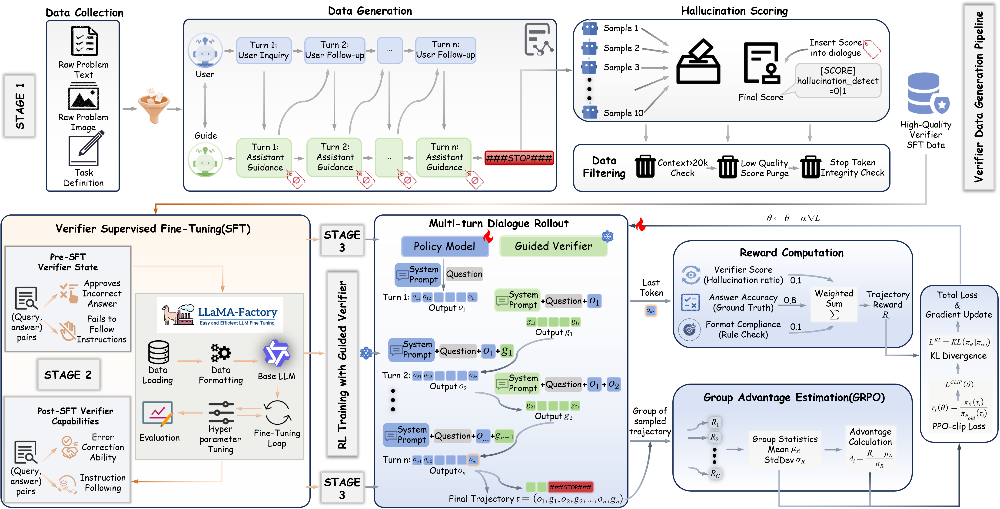

# Guided-GRPO

**Guided Reinforcement Learning for Multimodal Reasoning.**  
This repository contains Guided‑GRPO, a framework that injects **process‑level verification** into multimodal RL rollouts to stabilize training and reduce error propagation.

---

##  Method Overview
Guided‑GRPO is an RL paradigm that turns open‑loop rollouts into **closed‑loop** reasoning:
1. **Verifier‑guided rollout**: a lightweight verifier interacts with the policy at each step, correcting errors and providing minimal guidance.
2. **Process‑level signals**: step‑wise feedback turns sparse outcome rewards into denser training signals.
3. **GRPO update**: group‑based advantage estimation updates the policy without a separate value network.

To provide context for the RL stage, the full framework includes:
- **Stage 1 (data synthesis)**: generate multi‑turn solver/verifier trajectories with step‑level hallucination annotations, then filter for quality.
- **Stage 2 (verifier SFT)**: fine‑tune a lightweight verifier to produce minimal corrections and `[SCORE]` signals.



---

##  Features
- Supported models: Qwen2/Qwen2.5/Qwen3 (text), Qwen2‑VL/Qwen2.5‑VL/Qwen3‑VL
- Supported algorithms: Guided‑GRPO, GRPO, DAPO, GSPO, CISPO, Reinforce
- Supported datasets: any dataset that follows the [Data Format](#data-format)

---

##  Resources
- Guided Verifier (8B): [ruitongl/Guided-Verifier-8B](https://huggingface.co/ruitongl/Guided-Verifier-8B)
- Paper: [arxiv](https://arxiv.org/pdf/2602.04290)

---

##  Code Map
- [`verl/workers/rollout/vllm_rollout_spmd.py`](verl/workers/rollout/vllm_rollout_spmd.py)  
  Multi‑turn guided rollout (policy ↔ verifier) core implementation.
- [`verl/workers/rollout/config.py`](verl/workers/rollout/config.py)  
  Verifier configuration and default verifier prompt template.
- [`verl/workers/reward/function.py`](verl/workers/reward/function.py)  
  Injects `verifier_hallucination_score` into reward inputs (optional).
- [`verl/trainer/`](verl/trainer/)  
  Trainer, configs, and Ray orchestration.
- [`verl/trainer/main.py`](verl/trainer/main.py)  
  Training entrypoint.
- [`examples/`](examples/)  
  Ready‑to‑run configs and scripts.
- [`examples/reward_function/`](examples/reward_function/)  
  Reward function examples.

---

##  Installation
Clone and enter the repo:

```bash
git clone https://github.com/tongruiliu/Guided-GRPO.git
cd Guided-GRPO
```

```bash
pip install -r requirements.txt
```

(Optional) Docker environments are provided via `Dockerfile` and `Dockerfile.legacy`.

---

##  Requirements
- Python >= 3.9
- Ray (training orchestration)
- vLLM (rollout backend)
- CUDA‑capable GPU recommended
- FSDP optional (config‑controlled)

---

##  Quick Start
###  A) GRPO (no verifier)
Run standard GRPO training:

```bash
python3 -m verl.trainer.main \
  config=examples/config.yaml
```

Example script: `examples/qwen2_5_vl_7b_geo3k_grpo.sh`

###  B) Guided‑GRPO (multi‑turn verifier)
Guided‑GRPO runs multi‑turn rollouts where the verifier interacts with the policy at each step.

Edit `examples/config_multi_turn.yaml` (local verifier):
- `worker.rollout.verifier.enable: true`
- `worker.rollout.verifier.model_path: /path/to/verifier`
- optional `tokenizer_path`, `trust_remote_code`

Run:
```bash
bash examples/run_guided_grpo_local_verifier.sh
```

Edit `examples/config_multi_turn_http.yaml` (HTTP verifier):
- `worker.rollout.verifier.use_http: true`
- `worker.rollout.verifier.base_url: http(s)://...`
- `worker.rollout.verifier.model: <model_name>`
- `worker.rollout.verifier.api_key: <API_KEY>`

Run:
```bash
bash examples/run_guided_grpo_http_verifier.sh
```

> The client sends requests to `POST {base_url}/chat/completions` with an OpenAI‑style payload.

---

##  Configuration
Key fields (YAML):
- `data.max_prompt_length`, `data.max_response_length`
- `worker.rollout.n`, `worker.rollout.max_model_len`, `worker.rollout.max_num_batched_tokens`
- `worker.rollout.verifier.*` (enable, model_path / use_http, max_turns, prompt_template, etc.)
- `trainer.project_name`, `trainer.experiment_name`

**Important**: ensure
```
worker.rollout.max_num_batched_tokens >= data.max_prompt_length + data.max_response_length
```

---

##  Data Format
Each sample should provide:
- `prompt_key` (default: `problem`)
- `answer_key` (default: `answer`)
- optional `images` / `videos`

For images, include `<image>` placeholders in the prompt text (one per image). The loader will attempt to auto‑insert if missing.

---

##  Reward Functions
Reward functions live in `examples/reward_function/*.py`.

If `worker.rollout.verifier.enable_hallucination_score=true`, the verifier can append:
```
[SCORE] hallucination_detect=0|1
```
These are averaged into `verifier_hallucination_score` and passed to reward functions.

---

##  Logging & Checkpoints
Logging backends (configurable): `file`, `tensorboard`, `wandb`, `console`.  
Checkpoints are saved to `trainer.save_checkpoint_path` (default: `checkpoints/<project>/<experiment>`).

---

##  Limitations
- The verifier prompt template is task‑specific and should be tuned per domain.
- Multi‑turn rollouts add latency; plan GPU budgets accordingly.
- Verifier quality matters; weak verifiers can reduce training gains.

---

##  Citation
If you find this project useful for your research, please consider citing the following paper:

```bibtex
@misc{sun2026guidedverifier,
  title         = {Guided Verifier: Collaborative Multimodal Reasoning via Dynamic Process Supervision},
  author        = {Sun, Lingzhuang and Liu, Ruitong and Zhu, Yuxia and Xu, Xiaohan and Wei, Jingxuan and Zhang, Xiangxiang and Yu, Bihui and Zhang, Wentao},
  year          = {2026},
  month         = feb,
  eprint        = {2602.04290},
  archivePrefix = {arXiv},
  primaryClass  = {cs.CL},
  doi           = {10.48550/arXiv.2602.04290},
  url           = {https://arxiv.org/abs/2602.04290}
}
```

---

##  License
Apache 2.0 (see `LICENSE`).
